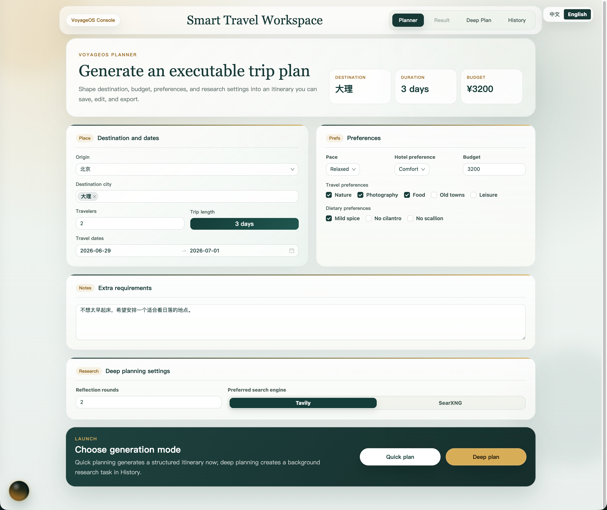
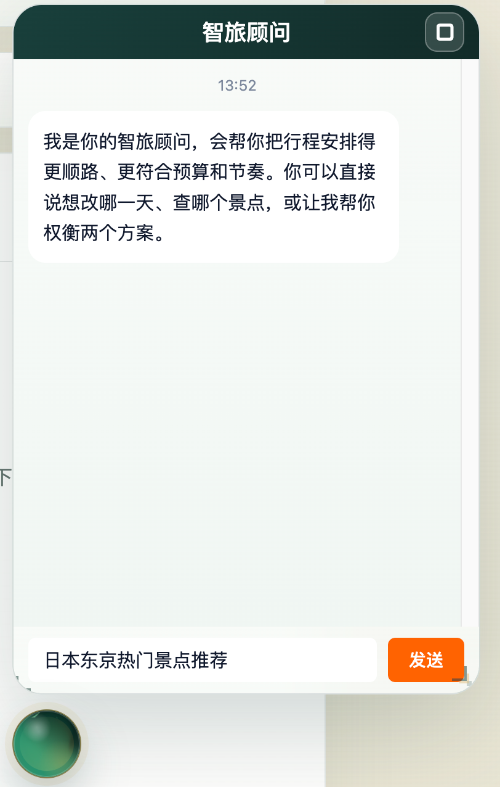

# Trip Planner 项目展示素材

这个目录用于存放 GitHub README 和项目说明文档中的展示素材。根目录 [`README.md`](../../README.md) 的“项目展示”部分会统一引用这里的截图、视频和报告样例。

## 素材清单

| 文件 | 内容 |
| :--- | :--- |
| [`01规划界面.png`](./01规划界面.png) | 规划页，展示目的地、日期、预算、人数、偏好和快速/深度规划入口 |
| [`02行程生成界面.png`](./02行程生成界面.png) | 行程结果页，展示概览、预算、天气、地图和每日安排 |
| [`03 深度规划研究过程.png`](./03%20深度规划研究过程.png) | 深度规划任务的研究过程、检索步骤和来源沉淀 |
| [`04 历史行程界面.png`](./04%20历史行程界面.png) | 历史行程页，展示快速规划、深度规划和历史 Report 入口 |
| [`聊天机器人界面.png`](./聊天机器人界面.png) | 结果页浮动旅行助手界面 |
| [`聊天机器人运行.mp4`](./聊天机器人运行.mp4) | 浮动聊天助手运行演示视频 |
| [`深度规划结果-厦门、汕头 2026-07-01 至 2026-07-15（15天14晚）旅行攻略.md`](./深度规划结果-厦门、汕头%202026-07-01%20至%202026-07-15（15天14晚）旅行攻略.md) | Destination Intelligence Agent 生成的深度规划报告样例 |

## 预览

| 规划页 | 行程结果 |
| :---: | :---: |
|  |  |

| 深度规划 | 历史行程 |
| :---: | :---: |
|  |  |

| 浮动聊天助手 |
| :---: |
|  |

## 维护约定

- 新增展示素材时优先放在本目录，并在本文件登记用途。
- README 中引用本目录文件时使用相对路径，带空格的文件名用 `%20` 编码。
- 当前目录会随项目一起上传到 GitHub，不会被 `.gitignore` 忽略。
